# GOV-VAULT: Parivar Netra 🏛️

### Unified Deep Learning-Based Family ID & Policy Management System

**GOV-VAULT** is a comprehensive e-governance platform designed to streamline family registrations, automate government welfare scheme recommendations through AI, and manage insurance policy claims with integrated fraud detection. It serves as a single source of truth for family data, bridging the gap between citizens and their entitled benefits.

---

## 🌟 Key Features

- **Unified Family Vault**: Create a digital vault for your family with secure, encrypted storage for sensitive documents (Aadhaar, PAN).
- **AI Scheme Saathi**: A RAG-based recommendation engine that suggests government schemes based on family demographics (income, occupation, caste, etc.).
- **Automated Policy Claims**: Integrated life insurance claim system that triggers automatically upon verified death reports.
- **Orphan Child Trust Fund**: A specialized direct-claim system for orphaned children with biometric registration and managed trust accounts.
- **Admin Governance**: A robust control panel for government officials to verify families, process claims, and manage trust funds.
- **Fraud Protection**: AES-256 encryption, deterministic hashing for duplicate detection, and JWT-based stateless verification.

---

## 🛠️ Technology Stack

- **Frontend**: Next.js 14, React, TailwindCSS, Framer Motion, TypeScript.
- **Backend Core**: Express.js, Node.js, Prisma ORM.
- **AI Microservice**: FastAPI, Python, Pinecone Vector DB, LangChain, Groq (Llama-3).
- **Database**: PostgreSQL 16.
- **Infrastructure**: Docker, Docker Compose.

---

## 📸 Project Walkthrough

### 1. Citizen Onboarding
The journey begins at the **Landing Page**, where citizens can explore the platform's benefits.

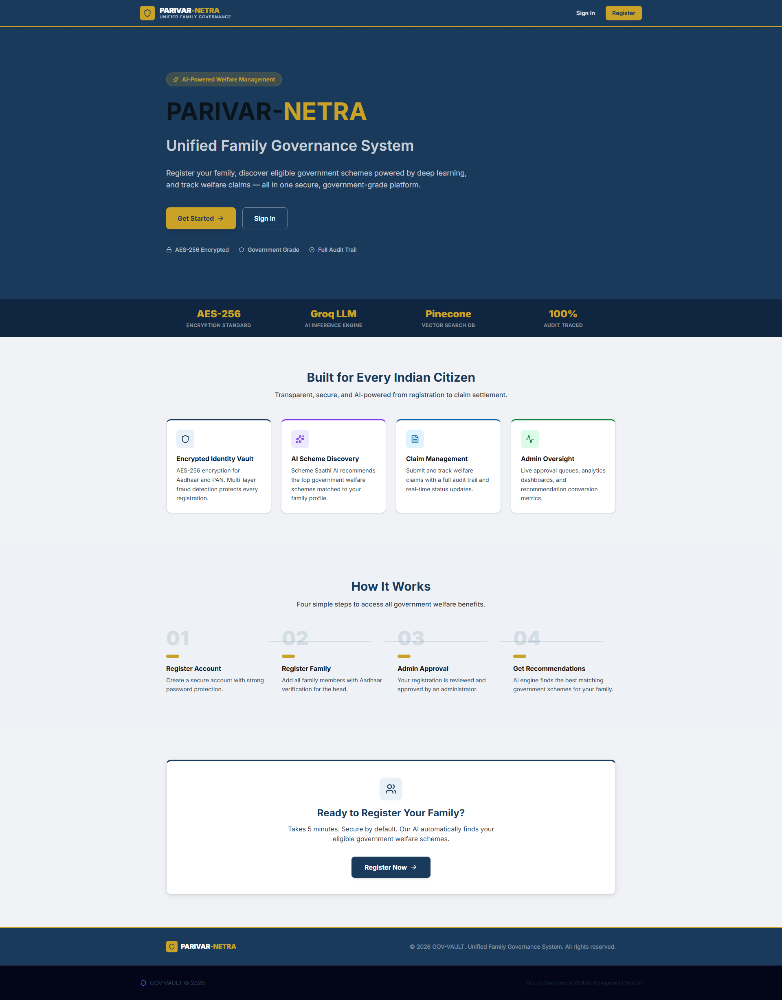

Users can **Register** and **Login** securely. The registration process includes mock government API verification for Aadhaar.

| Registration | Login |
|:---:|:---:|
| 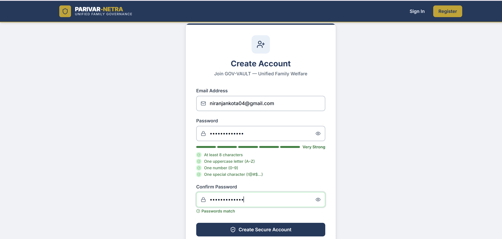 | 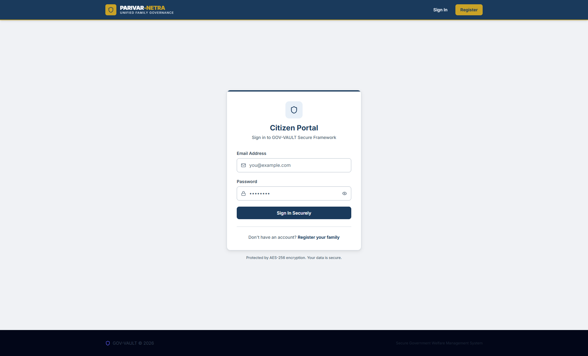 |

After entering family details, a **Temporary Family ID** is generated, and the family is queued for administrative verification.

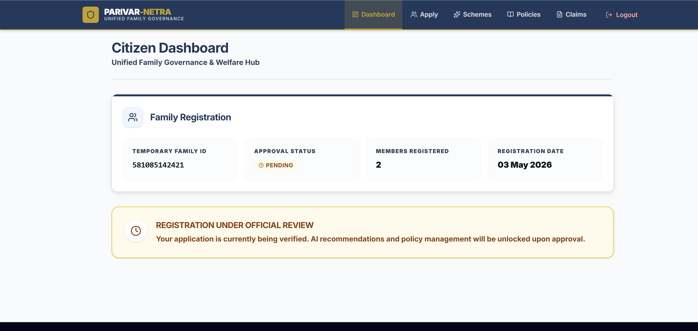

---

### 2. Administrative Governance
Government officials access the **Admin Dashboard** to oversee the system's status.

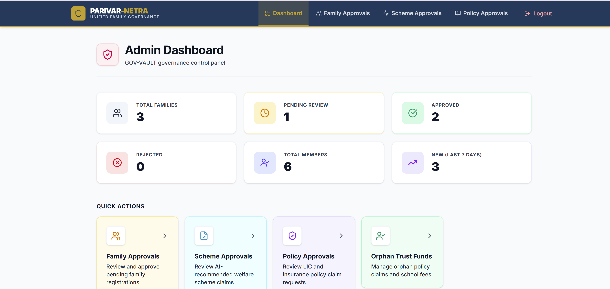

Admins review pending family registrations. If more documents are needed, an automated **Mail Request** is sent to the citizen.

| Family Approval | Request Documents |
|:---:|:---:|
| 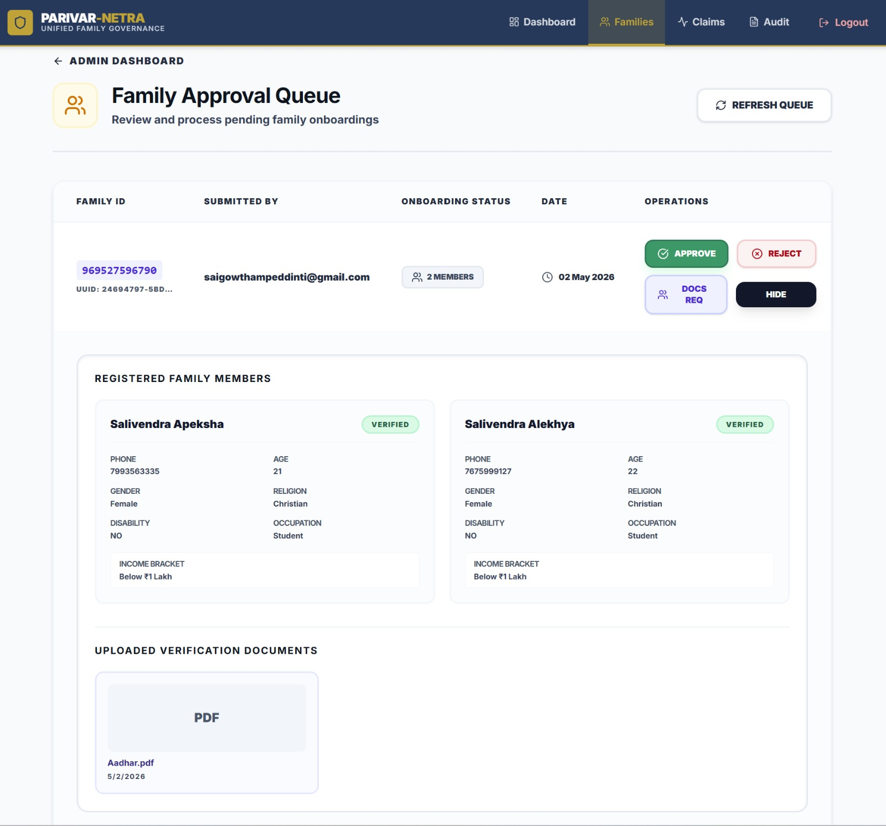 | 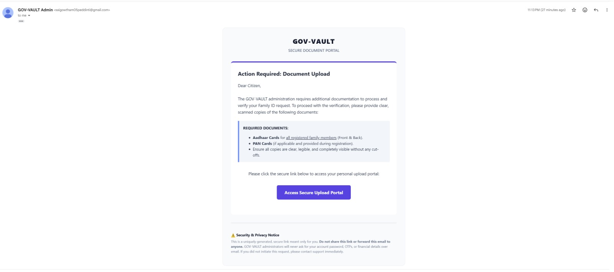 |

Citizens can then upload the requested documents through a secure link, which are instantly visible to the admin.

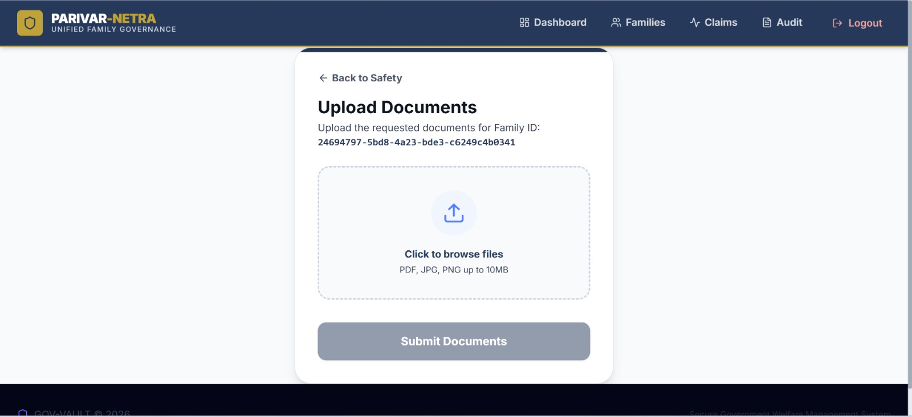

---

### 3. AI-Driven Recommendations (Scheme Saathi)
Once a family is verified, the **Scheme Saathi** engine analyzes the demographic data to recommend eligible government schemes.

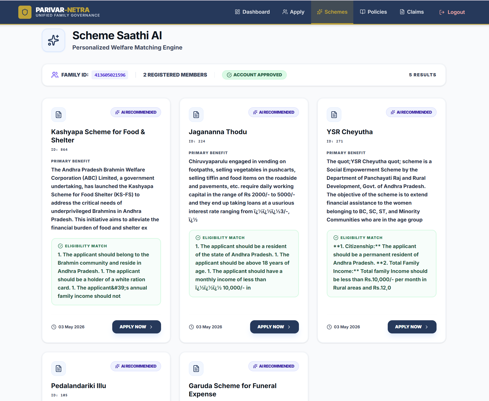

Citizens can view detailed eligibility reasons generated by the LLM (Llama-3) based on real-time data from the **Pinecone** vector database.

---

### 4. Policy & Claim Management
Citizens manage their linked insurance policies (e.g., LIC) through a dedicated **Policy Dashboard**.

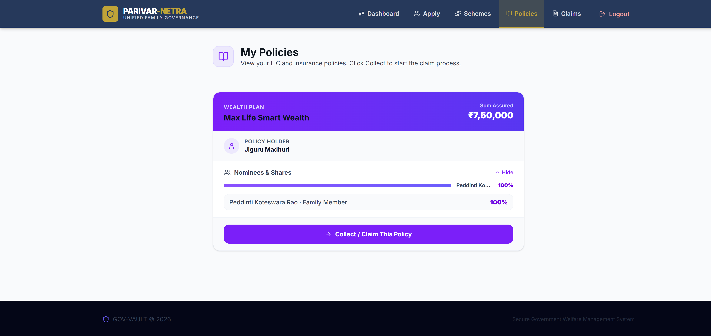

The system tracks life status. Upon a verified death report, the system automatically triggers a **Policy Claim** for the designated nominees.

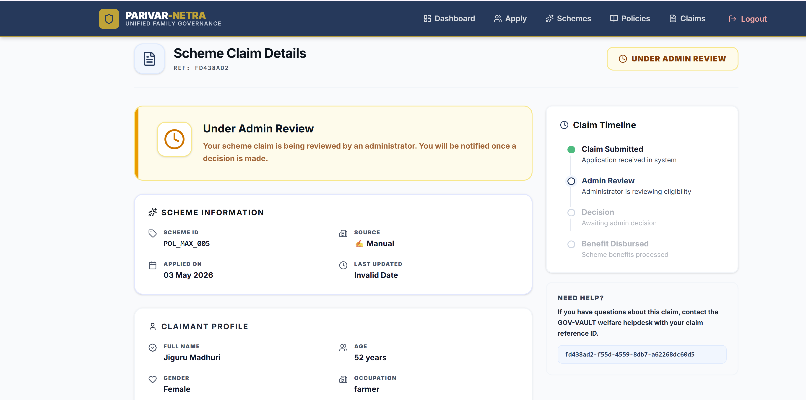

---

### 5. Specialized Workflow: Orphan Trust Funds
In the event of parental death where the beneficiaries are minors, the platform enables a direct center-walk-in registration using **Biometrics**.

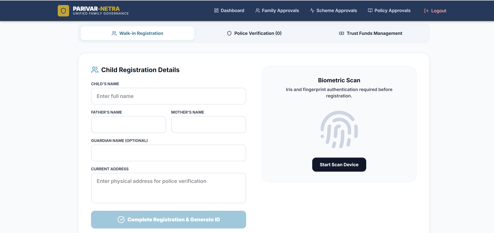

Admins can:
1. Capture mock Fingerprint/Iris biometrics.
2. Verify parental status via police verification.
3. Automatically provision a **Trust Fund** from parents' policies.
4. Directly deduct school fees or welfare expenses from the child's trust account.

---

## 🚀 Getting Started

### Prerequisites
- Docker & Docker Compose
- Groq API Key (for AI recommendations)

### Installation

1. **Clone the repository**:
   ```bash
   git clone https://github.com/Gowtham0507/Policy-Vault-Deep-Learning-based-Policy-Management-System.git
   cd Policy-Vault-Deep-Learning-based-Policy-Management-System
   ```

2. **Configure Environment Variables**:
   Copy `.env.example` to `.env` in the root and configure:
   - `JWT_SECRET`
   - `GROQ_API_KEY`
   - `DATABASE_URL`

3. **Spin up the stack**:
   ```bash
   docker compose up --build -d
   ```

4. **Setup Database**:
   ```bash
   docker exec govvault_backend npx prisma migrate deploy
   docker exec govvault_backend npm run seed
   ```

The application will be live at:
- **Frontend**: `http://localhost:3001`
- **Backend API**: `http://localhost:3000`
- **AI Service**: `http://localhost:8000`

---

## 📐 Architecture

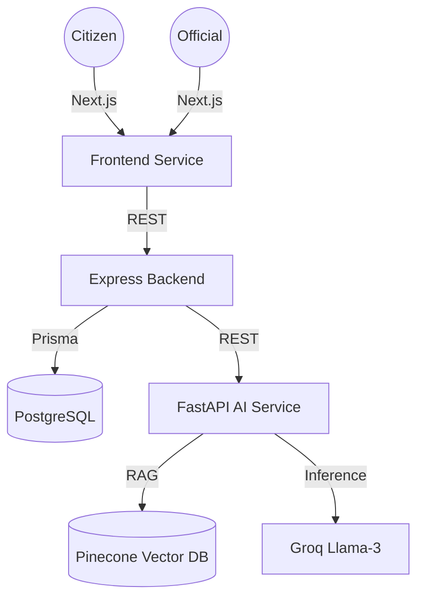

---

## 📄 License

This project is part of a Capstone initiative and is licensed under the MIT License.

---

Developed with ❤️ by **Gowtham**.
