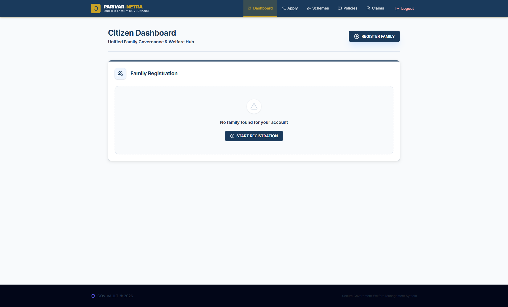
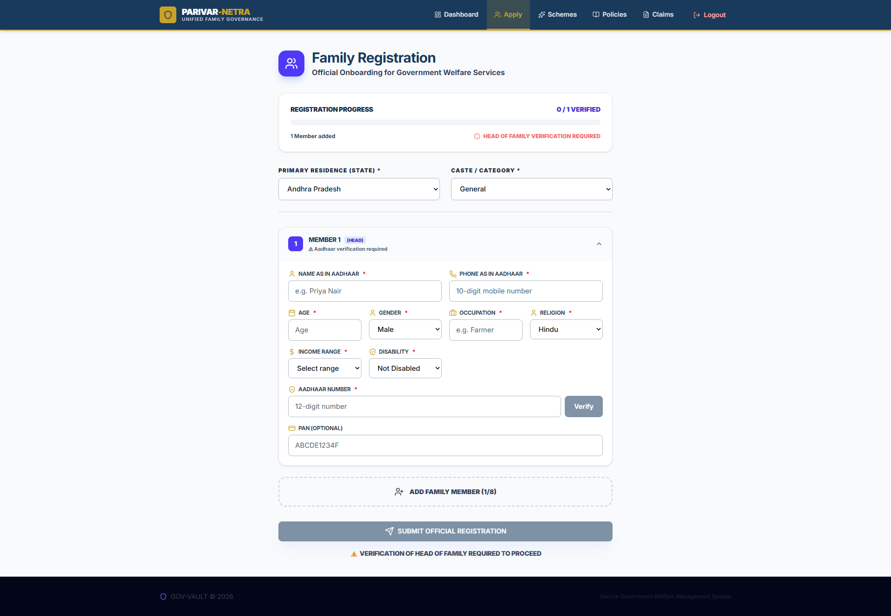
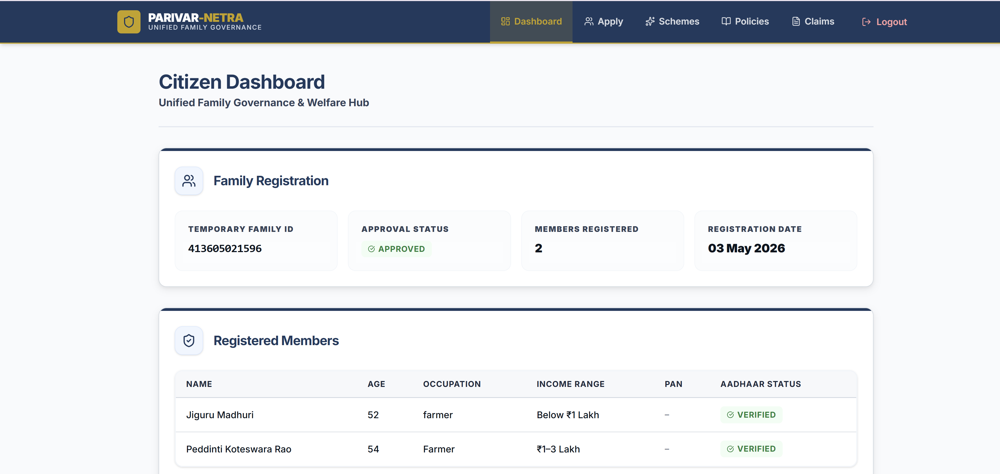
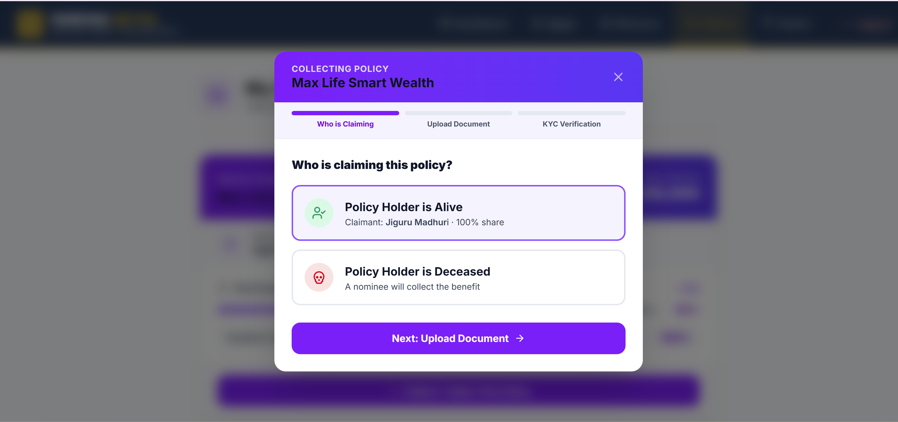
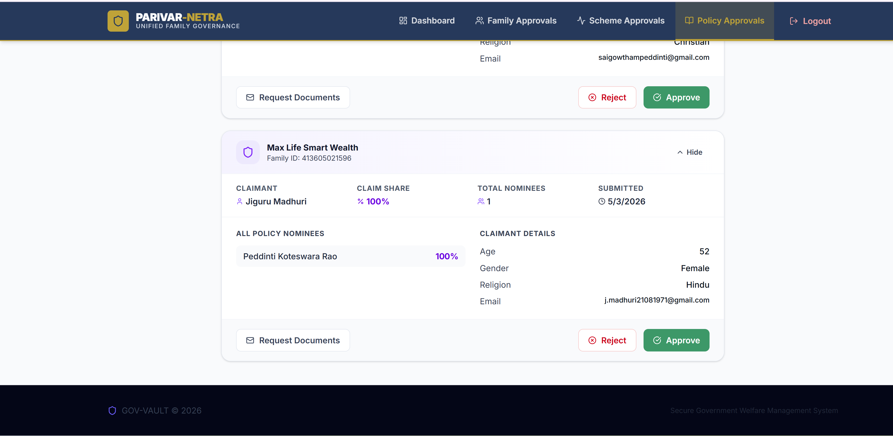
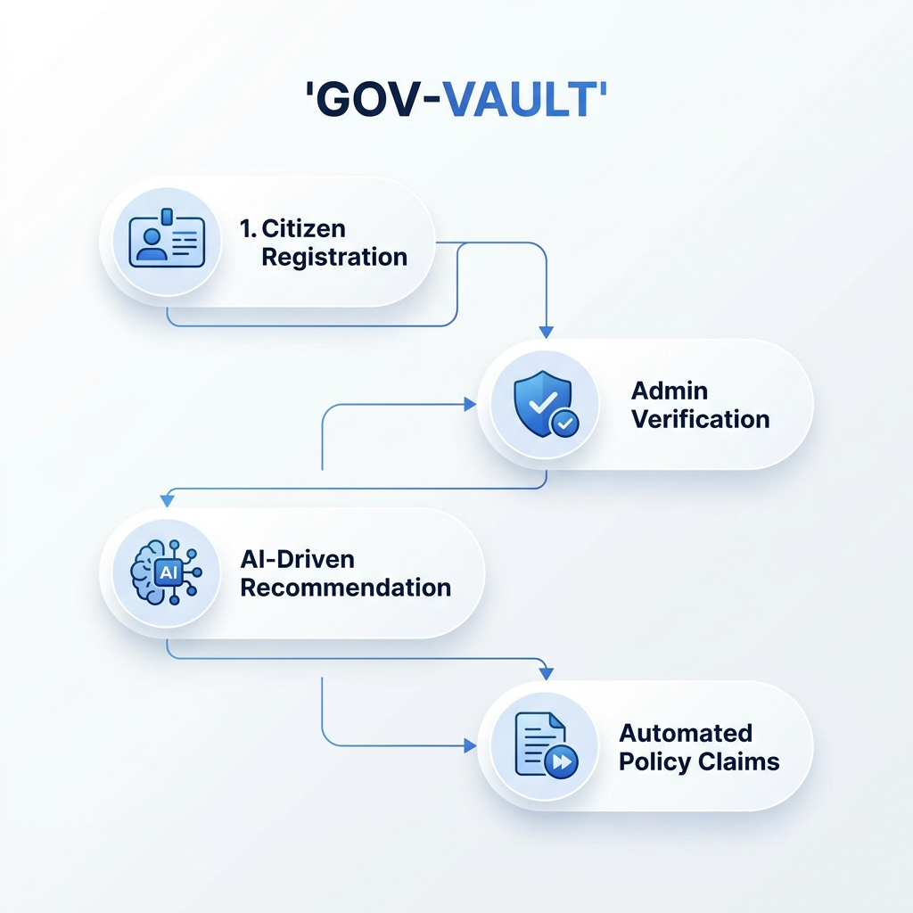
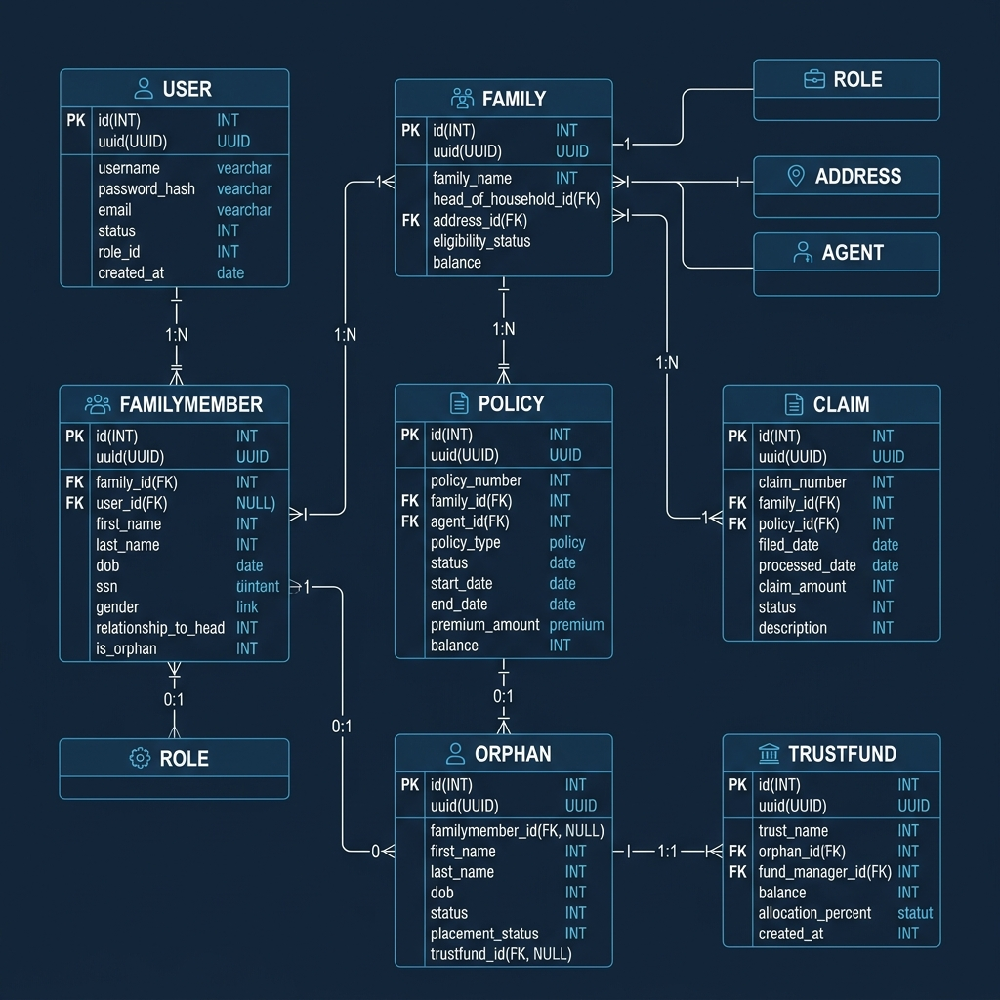
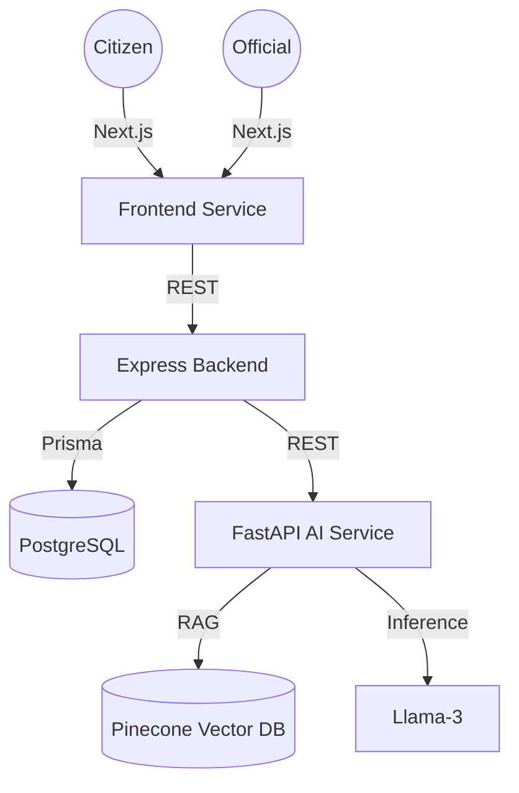

# GOV-VAULT: Parivar Netra

### Unified Deep Learning-Based Family ID & Policy Management System

GOV-VAULT is a production-grade e-governance ecosystem designed to solve the "Policy Awareness Gap." By combining a unified Family ID system (Parivar Netra) with Retrieval-Augmented Generation (RAG) AI, the platform ensures that citizens are connected to their entitled government benefits and insurance policies through a data-driven approach.

---

## Key Features

- **Unified Family Vault**: Provides secure, encrypted storage for sensitive family documentation, including Aadhaar and PAN credentials.
- **AI Scheme Saathi**: A RAG-based recommendation engine utilizing vector embeddings to suggest government schemes based on precise demographic data.
- **Automated Policy Claims**: An integrated insurance claim system that facilitates automated triggers upon the verification of death reports.
- **Orphan Child Trust Fund**: A specialized direct-claim module for minor beneficiaries, featuring biometric registration and managed trust account administration.
- **Administrative Governance**: A centralized control panel for government officials to oversee verification, process policy claims, and manage social welfare trusts.
- **Enterprise Security**: Implements AES-256 encryption, SHA-256 deterministic hashing, and JWT-based stateless authentication protocols.

---

## Project Workflow

This section documents the end-to-end operational lifecycle of the GOV-VAULT platform across seventeen sequential functional stages.

### Phase 1: Discovery and Onboarding

#### 1. Public Landing Page
The portal provides a centralized entry point for citizens to access unified family registration and AI-driven scheme discovery.


#### 2. Authentication Gateway
Users and administrators access the system via a secure, JWT-protected login interface.


#### 3. Citizen Registration
The registration process facilitates the creation of a secure family vault, utilizing mock government API verification for credential validation.


---

### Phase 2: Family Profile and Application

#### 4. User Onboarding Dashboard
The primary user interface guiding citizens through the initial family registration and documentation process.


#### 5. Demographic Submission
Citizens input family demographic data, including income, occupation, and caste metadata, which is encrypted before database persistence.


#### 6. Temporary ID Generation
The system provisions a unique Temporary Family ID upon submission, maintaining a pending status until administrative verification is complete.


---

### Phase 3: Administrative Governance and KYC

#### 7. Administrative Analytics Dashboard
Government officials monitor state-wide registration metrics and active verification queues through a centralized analytics interface.


#### 8. Verification Interface
Admins review submitted family structures and demographic metadata to ensure alignment with official records.


#### 9. Automated Documentation Requests
In instances of insufficient records, administrators trigger an automated document request dispatched via secure email protocols.


#### 10. Document Review Portal
Citizens upload required proofs through a secure link; these documents are accessible to administrators via an ephemeral review portal.


---

### Phase 4: Verified Access and AI Analytics

#### 11. Verified User Dashboard
The dashboard unlocks permanent features and verified vault status upon successful administrative approval.


#### 12. AI Scheme Saathi (RAG Engine)
Utilizing a Pinecone vector database and Llama-3 models, the system generates tailored welfare recommendations based on family profiles.


#### 13. Centralized Policy Management
The vault aggregates all active insurance and government policies linked to family members, providing a comprehensive view of household coverage.


---

### Phase 5: Policy Lifecycle and Automated Claims

#### 14. Status Monitoring
The system monitors life status through integration with official registries to identify triggering events for policy claims.


#### 15. User-Side Claim Tracking
Nominees can monitor the status of insurance claims and benefit transfers in real-time through the citizen portal.


#### 16. Administrative Claim Processing
Authorized officials verify documentation and trigger fund releases to registered bank accounts upon confirmation of claim validity.


---

### Phase 6: Specialized Social Welfare

#### 17. Orphan Child Trust Fund Administration
A specialized module for managing policy claims for minor beneficiaries, supporting biometric registration and managed trust fund disbursements for education and welfare.


---

## Technology Stack

- **Frontend**: Next.js 14, React, TailwindCSS, Framer Motion, TypeScript.
- **Backend Core**: Express.js, Node.js, Prisma ORM.
- **AI Microservice**: FastAPI, Python, Pinecone Vector DB, LangChain, Llama-3.
- **Database**: PostgreSQL 16.
- **Infrastructure**: Docker, Docker Compose.

---

## Installation and Deployment

### Prerequisites
- Docker and Docker Compose
- Groq API Configuration

### Deployment Steps

1. **Repository Initialization**:
   ```bash
   git clone https://github.com/Gowtham0507/Policy-Vault-Deep-Learning-based-Policy-Management-System.git
   cd Policy-Vault-Deep-Learning-based-Policy-Management-System
   ```
2. **Environment Configuration**: Configure the `.env` file with required secrets and API credentials.
3. **Container Orchestration**:
   ```bash
   docker compose up --build -d
   ```
4. **Database Initialization**:
   ```bash
   docker exec govvault_backend npx prisma migrate deploy
   docker exec govvault_backend npm run seed
   ```

---

## System Architecture and Design

### Functional Workflow
The following diagram illustrates the end-to-end functional flow of the platform, from citizen onboarding to automated policy claim execution.



### Entity-Relationship (ER) Diagram
The database schema is designed for high relational integrity and security, ensuring encrypted storage and efficient data retrieval across all microservices.



### Service Orchestration



---

## License

This project is licensed under the MIT License.
.
